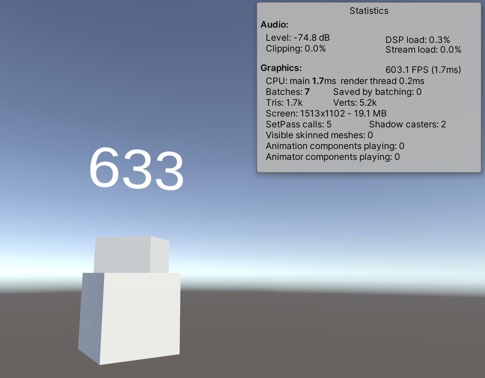

# Unity-FPS-counter

A simple FPS (Frames Per Second) counter for Unity. Compatible with VR. Using TextMeshPro.

[https://github.com/prossel/Unity-FPS-counter](https://github.com/prossel/Unity-FPS-counter)

## Installation

### With package manager

* Unity, menu Window > Package Manager
* Click the [ + ] button at top left
* Add Package from git URL...
* Enter this URL: `https://github.com/prossel/Unity-FPS-counter.git`
* When you want to update the package, just use the [ Update ] button from the package in the package manager.

### Manually (deprecated)

* Download latest .unitypackage file from [https://github.com/prossel/Unity-FPS-counter/releases](https://github.com/prossel/Unity-FPS-counter/releases)
* Add to your unity project

## Usage

* Drag the `(Packages|Assets)/FPS Counter/Prefabs/FPS Counter` prefab file to your scene
* Place it where you want in your scene

or

* Add the `(Packages|Assets)/FPS Counter/Scripts/FPSCounter` component to any TextMeshPro text

## History

See [CHANGELOG.md](CHANGELOG.md)
